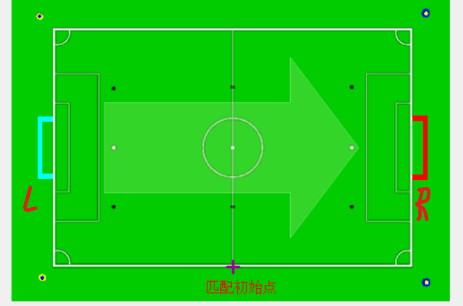
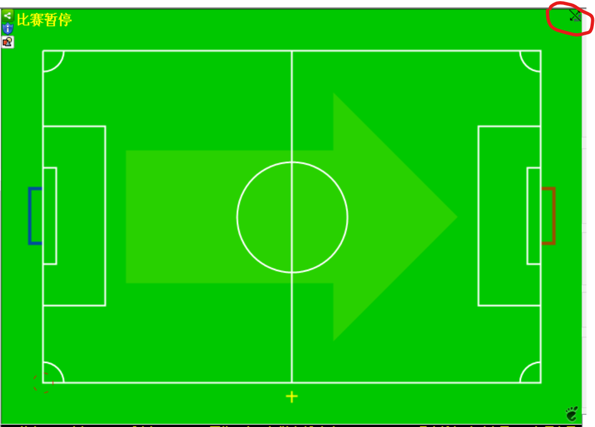

# 守门员程序上手

> 语言：**中文** | [English](use.en.md)

## 快速启动

* 将机器人放在己方球门的**球门内**
* 开启急停开关，底盘上电，此时应该能在教练机上看到守门员连接成功的信息，且可以正常指挥守门员
* 如果守门员无法被正常指挥，比如走不出球门，则需要将底盘断电再向球门内推一点，重复上述步骤即可

## 设定球门

* 首先将机器人放在己方球门的**球门内**

* 连接上教练机后，**左键单击**己方球门，**右键单击**对方球门，此时教练机上应该显示守门员在己方球门内，且可以正常指挥守门员运动

  

* 而后在教练机上确认进攻方向，若蓝队攻红队则是默认情形，如果是红队攻蓝队则点击画面右上角的图标使之翻转

  
