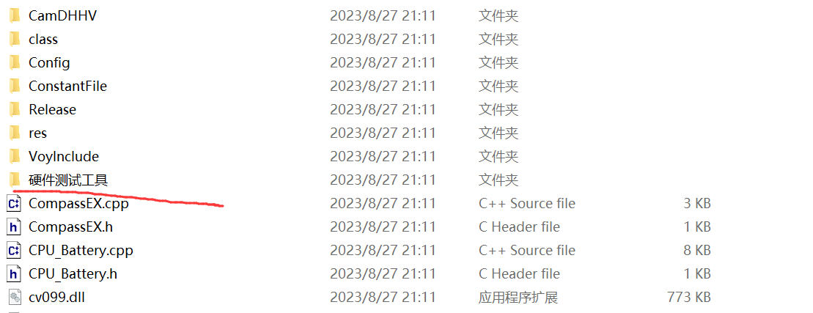
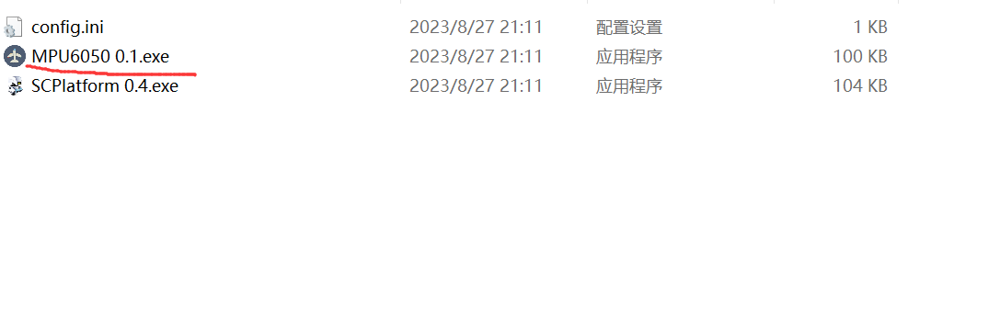
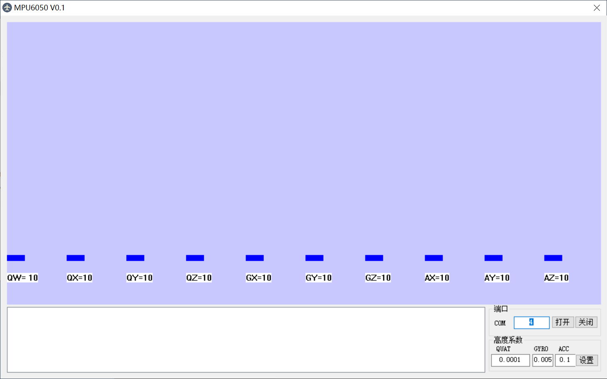
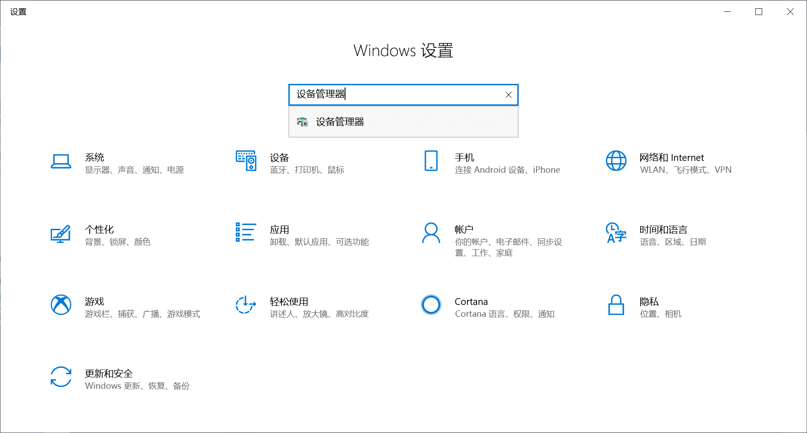
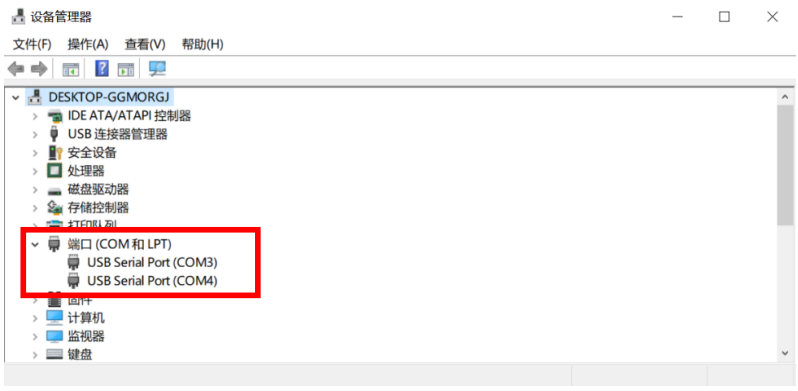
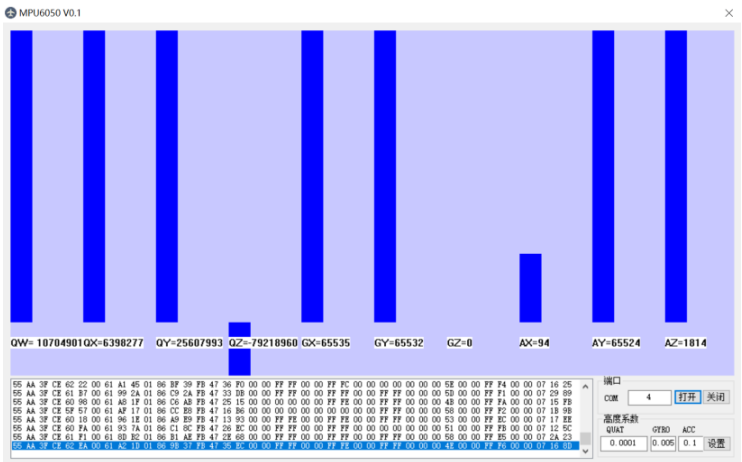

> 作者：Hcm
>
> 时间：2023年8月27日

# MPU6050 0.1.exe使用教程

> 语言：**中文** | [English](use.en.md)

软件在的地方↓

软件长相↓

这个软件是用来连接机器中的MPU模块的，可以得到机器人的姿态啥的信息，正常要先查看**当前电脑的设备管理器**（当前电脑指的是机载电脑）,

一般是有两个USB设备，可以看到这边是`COM3`和`COM4`，在软件界面任意选择一个COM口输入，当看到如下的显示时，说明连接对了，那另一个串口就是控制机器人的底盘的。

这个软件使用非常简单，可以说没有任何难度，我感觉主要就是用来测试两个端口哪个是传MPU的数据，哪个是和底盘通信的。
