# README

> Language: [中文](Readme.md) | **English**

Runtime code.

## File Description

- GoalKeeper: goalkeeper code
- MSLFieldMonitor: coach-station code
- MSLRobot: player code

## Update Notes

### MSLFieldMonitor

#### CToAgent() coach-to-player operation class

##### 2023-08-29 by ShitT

* CtrlCmd() control command

`m_sendbuf[99]` stores the control command. Starting from here, look at the `UDPAgent()` class on the player side and trace the `ATTACK` command, which is numeric value `1`.

#### CCoachUDP() communication class

##### 2023-08-26 by ShitT

* m_ParseFrame(*inBuf, inLen) received data-frame parsing method

The parameters `inBuf` and `inLen` are the data packet and its length. First describe the packet structure, then describe what this method does.


The packet is an `unsigned char` array pointer. Each position in the array is one byte.

The `?` positions are not mentioned in the code. They are probably occupied by a relatively large value spanning several bytes, or are used to adjust the overall value for verification. This can be checked later.

After the data frame and its length are passed in, the method verifies the checksum. The last byte of `inBuf` is the checksum byte, and `m_calsum` simply sums the whole `inBuf`. If the two values are equal, the verification passes.

```cpp
unsigned char chk_sum = m_calsum(inBuf,inLen-1);
unsigned char rec_sum = inBuf[inLen-1];
if (chk_sum != rec_sum)
{
	printf("校验和错误！");
	return;
}
```

If `m_recvAgent[m_curID-1]`, meaning the currently sending player in the data frame, is not online, the code uses that player object's method to set the corresponding IP and port, flips its online state, and sends it a stop command.

Next is the `switch` statement that identifies the received data type. During debugging there may have been other types, but currently there is only one type: `MSL_INFO`, the player information type.

After entering the case, it first checks whether the player has found the ball, updates that player's information, and increments that player's receive counter.

```cpp
//更新队员信息
m_recvAgent[m_curID - 1].ID = m_curID;
m_recvAgent[m_curID - 1].x = m_Piece2int(&inBuf[5]);
m_recvAgent[m_curID - 1].y = m_Piece2int(&inBuf[7]);
m_recvAgent[m_curID - 1].angle = m_Piece2int(&inBuf[9]);
m_recvAgent[m_curID - 1].V = m_Piece2int(&inBuf[16]);
m_recvAgent[m_curID - 1].V_Angle = m_Piece2int(&inBuf[18]);
m_recvAgent[m_curID - 1].status = (0x7f & inBuf[11]);
m_recvAgent[m_curID - 1].foundball = m_bFoundBall;
m_recvCnt[m_curID - 1] ++;
```

The remaining operations are already commented in the code and are not expanded here.

`m_recvAgent` is of type `uAgent`. It can be found in the class view. It is a struct that records many kinds of information.

`m_ToAgent` is of type `CToAgent`. It can also be found in the class view. Its methods are the coach station's controls for players.

Another point worth noting: the data transmitted over UDP is binary, so `m_Piece2int()` and `m_Piece2float()` convert it into integer and floating-point values.

Names starting with `C` are classes. Names starting with `m` are member methods or member variables.

#### CTac_Counter_KickOff

##### 2023-08-23 by Hcm

> Analyzed the `CTac_Counter_KickOff` class, studied its execution flow, and improved the comments.

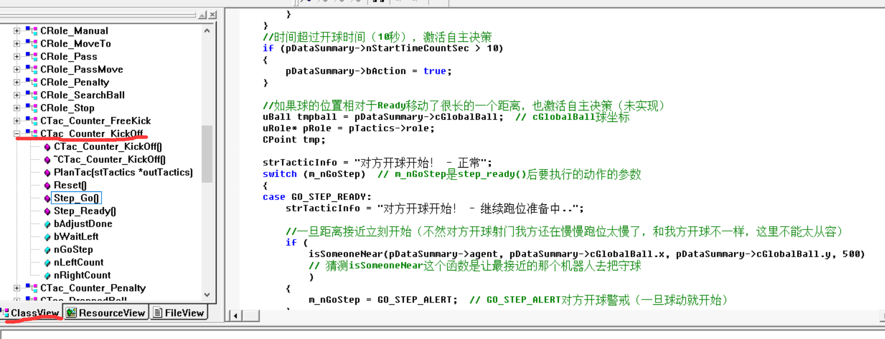

> One finding:
>
> 1. `Counter` refers to our response strategy when the opponent is the active side.

#### CTac_Counter_FreeKick

##### 2023-08-24 by Hcm

> This is the strategy for handling an opponent free kick. The annotations are about halfway complete. This file contains many actual strategy changes and is somewhat strange, so it needs more time for review.

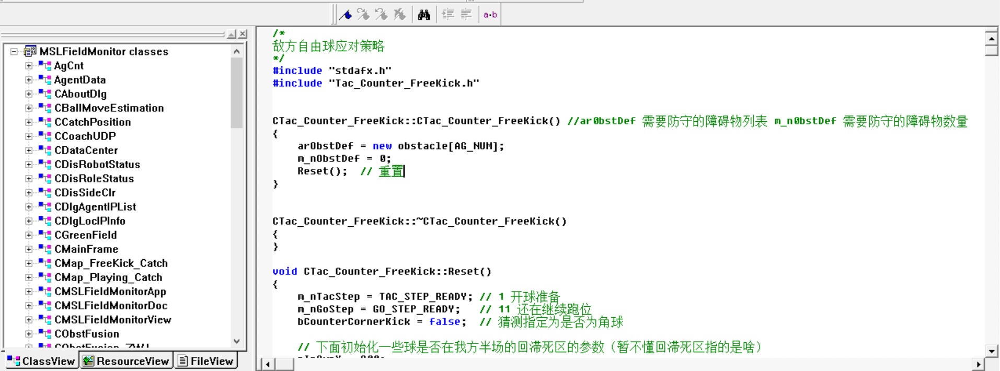

#### CTac_KickOff

##### 2023-08-25 by Hcm

> This is the basic strategy for our kickoff. Some basic comments were added. It was also found that the code framework for each strategy is generally similar.

#### CTac_Off

##### 2023-08-05 by Hcm

> This class basically contains nothing. It is probably called when the match is stopped or paused. After this class is called, manual control becomes available.

#### CTac_ParkIn

##### 2023-08-05 by Hcm

> This class is called when robots enter the field. It only sets the positions of the five robots and does not contain anything extra.

#### MSL_Structs.h

##### 2023-08-24 by Hcm

> This file defines the common structs, parameters, and related data used across the whole codebase. If you are unsure about the properties of parameters defined in the code, you can usually find them here.

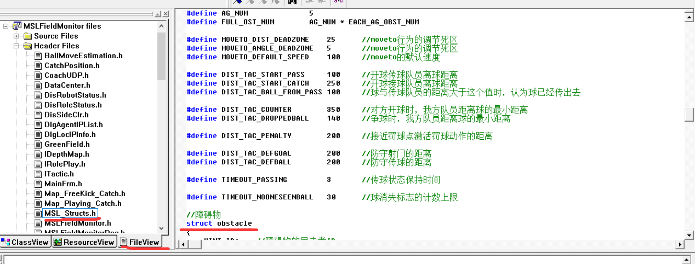

#### ITactic.h

##### 2023-08-24 by Hcm

> The `ITactic` class contains flags corresponding to player strategies. It also defines functions that are called by strategies. Their concrete implementations can also be checked.

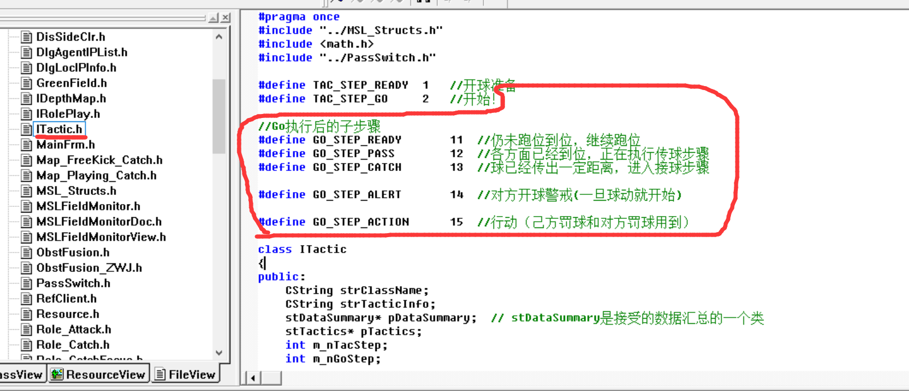

#### ITactic.cpp

##### 2023-08-24 by Hcm

> This file implements calculations needed for strategy assignment. It is a relatively concrete module and has lower coupling compared with other files. If later requirements appear, calculation methods can be added directly in this file. This update completed explanations for about one third of the functions that previously had no comments. The rest can be continuously updated as they are encountered in strategy code.

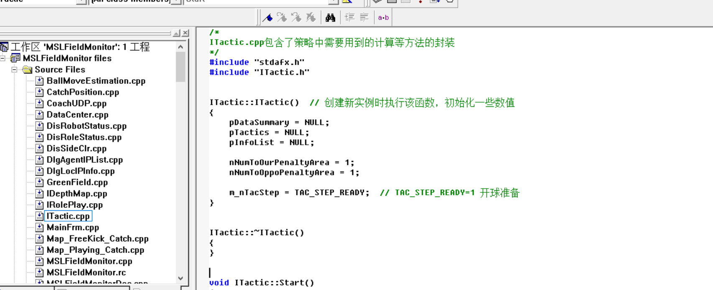

### MSLRobot

#### CAgentUDP()

##### 2023-08-29 by ShitT

* Received() processing after data is received

This function basically only checks the IP address and performs some simple verification. Then it parses the packet byte by byte in a loop.

* ParseByte() byte-by-byte data parsing

This function assembles bytes one by one into the `m_ParseBuf[]` array, obtains verification information such as length, and then passes the data to `ParseFrame()` for parsing.

* ParseFrame() data-frame parsing

It first verifies the frame, then obtains teammate information, obstacle information, initial-position coordinates, and ball coordinates from the data. According to different `rec_ctrl` control commands, it decides whether other information needs to be obtained, using a `switch case` statement.

Searching for `rec_ctrl` and `re_ballx` shows that both variables belong to the `CAgentUDP` class and only appear in data-frame parsing. At the same time, `net.rec_ctrl` and `net.re_ballx` were also found.

The `net` instance is a `CAgentUDP` object created inside the `CGetImage()` class. **Check this later.**

In the part where `net.rec_ctrl` appears (`net.toS_status = net.rec_ctrl`), there is also a `switch case` statement. When the command is `ATTACK`, the variable `xingwei` is defined as `1`.

Then searching for `xingwei==1` finds that the only place containing this statement has one `ATTACK`-related line:

> temp_x=y.quanbx

This introduces `y.quanbx`, `temp_x`, and `temp_a`.

Variables such as `temp_x` are assigned from `net.rec_CFtargetx` and similar values when they are defined, so they are probably received target coordinates or related values.

* `temp_x` eventually leads to the `track_black_OBJ_map_X[]` array. Continuing the trace finds the `f2l_radius()` function. **Check this later.**

The return value of this function is assigned to `min_dis_OBJ_dis`. These `OBJ` values should mean obstacles. This may be related to obstacles. Continuing further shows that the value is passed into the `SetBall` function in the `m_find.pField` class. `m_find` is an instance of `UPRColor`, and `pField` is a pointer to a `CUPFullField` class. The `setBall` function is probably used for drawing.

* In `y.quanbx`, `y` is the `Yuzhi` struct, and `quanbux` is a parameter. There are many variables named `y`, but this one is probably the most likely match.

Following this path seems to show mostly drawing-related functionality.

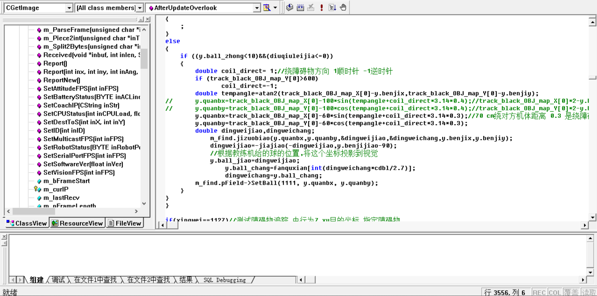

* `temp_a` is set to `0` and is not called afterward.

#### UPRColor()

##### 2023-08-30 by ShitT

* pipei2_5() line-matching function that is actually used

It first processes `benjix` and `benjiy` in the `changdi` struct to prevent out-of-bounds values, then converts them to `l_x` and `l_y`. These two variables are later used by the steepest-descent method. The algorithm needs closer review later. It was found that this part even displays each descent path, so it is worth checking on the robot later.

After that comes the drawing part, and finally the code interface. `zuixiaox1`, `zuixiaox2`, and `zuixiaojiao` are converted back as output coordinates. They are probably referenced directly afterward.

Some comments were added for matching 2.5, but it still needs closer reading.

##### 2023-08-28 by ShitT

* pipei() matches the current image with the model image

This is the player's localization function. It is buried very deeply. First, near the bottom of `AfterUpdateOverlook()` in the `CGetImage()` class, an `m_find` instance was found. Looking further shows that it is a `UPRColor()` class. In that class, `pipei()` was found, and then a `dingwei()` function was also found.

At a rough glance, `dingwei()` uses the sizes of the opponent goal and our goal, perhaps manually bound, to determine which half of the field the robot is in. If so, this should be combinable with the boundary scanned by rays to accurately determine which corner of the field the robot is in. Robots tend to behave erratically in field corners, which is why this part was being inspected. The question becomes whether there is logic for judging goal size.

Another possibility is that the robot is not using version 2 or 2.5 of the `pipei` function, which might cause the erratic behavior. It was found that only `pipei2.5` is used; the other versions are not used. The main focus should be `pipei2_5`.

Yet another possibility is that the code in `AfterUpdateOverlook()` is not localization at all, but something else.

#### CRadarScan()

##### 2023-08-25 by ShitT

* CRadarScan() variable initialization and ~CRadarScan() variable cleanup

```CRadarScan()```:

Initializes several variables. Their roles are described later in the `Scan()` method, which is the concrete scanning method.

It initializes the ray point tables `rayx` and `rayy`. A circle, `2pi`, is divided into 144 rays, and each ray has length 240.

Nested `for` loops write the coordinate information of each ray. For example, the x coordinate of ray 0 is stored in `rayx`, and its y coordinate is stored in `rayy`.

```cpp
//初始化
//这里的x2与y2不代表直角坐标系下的横横纵
//x2指将一个圆分成几份 y2指圆的半径...
for(int x2=-72;x2<72;x2++)
for(int y2=0;y2<240;y2++)
{
	rayx[(x2+72)*240+y2]=sin(x2*2.5/57.4)*y2+320;
	rayy[(x2+72)*240+y2]=cos(x2*2.5/57.4)*y2+240;
}
```

```~CRadarScan()```: releases the memory used for scanning.

* Scan() radial scanning function

Parameters:

```UCHAR *inmap,int inWidth, ```

```int inHeight,UCHAR inVal,int inSpan```

These are, respectively, the input image, input image width, input image height, the value to scan for, and the step size.

The nested loops scan outward from radius 20, at an interval of one ray every `inSpan` rays. If a pixel in `inmap`, meaning the image, has the required value, the counter increments by 1. When the counter is greater than 3, the current point is treated as the target point. Its coordinates are stored in `resultx` and `resulty`, and its distance from the center is stored in `distance`. The loop then breaks, meaning this ray is done.

If the scan reaches radius 239 without breaking, this ray does not contain the required value. The code writes `-1` to `result` and `240` to `distance`.

```cpp
m_pMap = inmap;
m_nWidth = inWidth;
m_nHeight = inHeight;
for (int i=0;i<144;i+=inSpan)//射线迭代
{
	count = 0;
	for (int j=20;j<240;j++)//距离迭代
	{
		index = i*240+j;
		if (m_pMap[(rayy[index])*m_nWidth+rayx[index]] ==inVal)
		{
			count ++;//计数器自增
			if (count > 3)//写入点信息
			{
				resultx[i] = rayx[index];
				resulty[i] = rayy[index];
				distance[i] = j;
				break;
			}
		}
		if (j == 239)
		{
			//扫到射线末端还没跳出循环，说明没扫描到
			resultx[i] = -1;
			resulty[i] = -1;
			distance[i] = 240;
		}
```

##### 2023-08-26 by ShitT

* Line() retrieves a line

Parameters:

`inBuf`, `inIndex`, `red`, `green`, `blue`

`inIndex` is the index of the line to retrieve, ranging from 0 to 144. The three RGB parameters specify what color to draw on that line. `inBuf` is the input buffer, and the final colored image information is stored there.

From GPT:

> First, it checks whether the distance at the given index, `distance[inIndex]`, is less than 0. If so, it returns `FALSE`. Then it loops from 0 to `distance[inIndex]`, meaning the radar scanning distance. In each iteration, it calculates the position `loc` to modify in the input buffer according to the index `inIndex` and the current iteration value `index`. Finally, it sets the pixel value at `loc` in the input buffer to the specified color, blue, green, and red. When the function finishes, it returns `TRUE` to indicate successful execution.

```cpp
BOOL CRadarScan::Line(UCHAR* inBuf,int inIndex, UCHAR red, UCHAR green, UCHAR blue)
{
	if (distance[inIndex] < 0)
	{
		return FALSE;
	}
	int loc;

	for (index=0;index<distance[inIndex];index++)//逐像素点扫描射线
	{
		loc = rayy[inIndex*240+index]*m_nWidth*3 + rayx[inIndex*240+index]*3;
		inBuf[loc] = blue;
		inBuf[loc + 1] = green;
		inBuf[loc + 2] = red;
	}
	return TRUE;
}
```

The calculation of `loc` is explained below:

`loc = rayy[inIndex*240+index]\*m_nWidth\*3 + rayx[inIndex*240+index]*3;`

`rayy` and `rayx` are two arrays that store the y and x coordinates of each point in the radar scan. In this calculation, multiplying the index `inIndex` by 240, assuming each radar scan line has 240 points, and adding the current iteration value `index` gives the index of the current point in the `rayy` and `rayx` arrays.

Next, multiplying `rayy[inIndex*240+index]` by `m_nWidth*3` gives the row position of that point in the input buffer, assuming the input buffer width is `m_nWidth` and each pixel occupies 3 bytes for the RGB channels.

Finally, multiplying `rayx[inIndex*240+index]` by 3 gives the column position of that point in the input buffer.

Adding the row and column positions gives the pixel position `loc` in the input buffer.

* GetPoint() obtains point coordinates

Parameters: `inIndex`, `inDistance`, `*inPnt`

They represent the ray index in the radial scan, the distance from the center, and the pointer to the input point struct.

In practice, this is doing a transformation similar to polar coordinates to Cartesian coordinates.

* Sector() uses sectors to distinguish connected components

This method iterates through each ray and finds connected components with the same color.

First, the function initializes several variables, including `linesum`, which accumulates valid ray indexes, `num`, which counts valid rays, and `m_nNumofSector`, which records the number of sectors.

Then it sets the initial scan range: `mintoscan` and `maxtoscan` are initialized to 0 and 143.

Next, the code starts scanning the area near line 0. If the distance of line 0, index 0, is not 240, meaning it is a valid ray, the loop begins.

Inside the loop, it first scans to the right side of line 0, iterating over indexes 0 through 143. If the distance for the current index is less than 240, it accumulates `linesum` and `num`, and writes the index into the `anticlockwise` array.

```cpp
		//先扫零号线右侧
		for (int i=0;i<144;i++)
		{
			if (distance[i] <240)
			{
				linesum += i;
				num ++;
				anticlockwise[m_nNumofSector] =i;
			}
			else
			{
				break;
			}
		}
```

Then it scans the left side of line 0, decrementing from 143 to `anticlockwise[m_nNumofSector]`. If the distance for that index is less than 240, it accumulates `linesum` and `num`, and updates the index into `clockwise[m_nNumofSector]`. The code is similar, so it is not shown here.

If `num` is greater than 0, the code calculates the sector's `midline` and `sumoflines`, then increments `m_nNumofSector`.

Finally, it updates the remaining scan area by setting `mintoscan` to `anticlockwise[0]` and `maxtoscan` to `clockwise[0]`.

```cpp
		if (num >0 )
		{
			midline[m_nNumofSector] = anticlockwise[m_nNumofSector] - (144-clockwise[m_nNumofSector]);
			if (midline[m_nNumofSector] > 0)
			{
				midline[m_nNumofSector] = midline[m_nNumofSector]/2;
			}
			else
			{
				midline[m_nNumofSector] = 143 + (midline[m_nNumofSector]/2);
			}
			sumoflines[m_nNumofSector] = num;
			m_nNumofSector ++;

			//更新剩下的扫描区域
			mintoscan = anticlockwise[0];
			maxtoscan = clockwise[0];
		}
```


Next, the code enters a `while` loop to scan the remaining area. The loop condition is that `maxtoscan` is greater than `mintoscan`.

Inside the loop, `linesum` and `num` are initialized, and a flag named `flag` is set to false. Then it iterates from `mintoscan` to `maxtoscan`.

If the distance for the current index is less than 240, it checks whether `flag` is false. If so, it sets this index to `anticlockwise[m_nNumofSector]` and sets `flag` to true.

Then it accumulates `linesum` and `num`.

If the distance for the current index equals 240 and `flag` is true, that means the scan has left the current connected component. The code sets the current index minus 1 to `clockwise[m_nNumofSector]`, then calculates the sector's `midline` and `sumoflines`.

Finally, it updates `mintoscan` to the current index, breaks out of the current loop, and starts the next `while` loop.


After the `while` loop ends, the code performs bubble sorting on the sectors. The sorting key is `sumoflines`, meaning the number of valid rays.

Finally, the function returns `TRUE` to indicate successful execution.

Overall, this code splits radar-scan data into different sectors and sorts those sectors. Each sector is made of adjacent valid rays, including the center-line index, clockwise and counterclockwise boundary indexes, and the number of valid rays.

* CalAngle(int inx, int iny) calculates angle

For the full 640x480 image, the original coordinate system uses the upper-left corner as the origin. This method first translates the origin to the center, so the coordinates `inx` and `iny` become `dx` and `dy` in a centered coordinate system. In this coordinate system, right is the positive x direction and down is the positive y direction.

It then calculates the angle. The overall goal is to obtain the angle information corresponding to the input `(x, y)` coordinate. The image center is used as the origin of a Cartesian coordinate system. The positive half of the y axis is angle 0, and counterclockwise is the positive angle direction. For example, point `(1, -1)` lies on the 135-degree ray.

#### StdAfx.h

##### 2023-08-23 by Hcm

> Found parameters for adjusting the field-size ratio and controlling the maximum device movement speed.

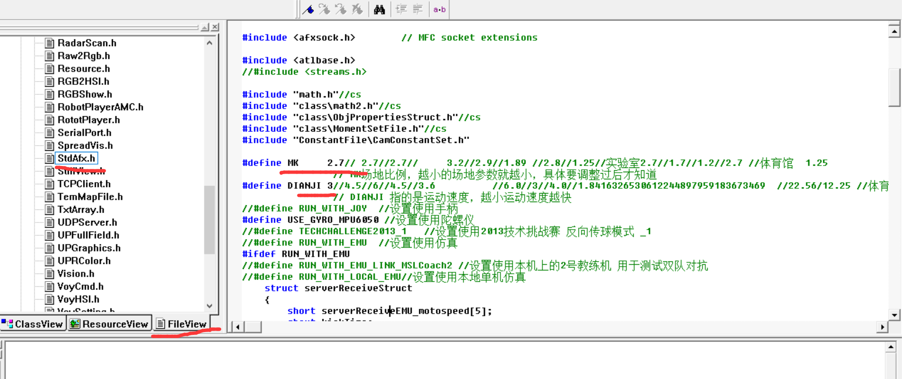

> Note: If some files do not appear in the file list on the left, find `Header Files` or `Source Files`, right-click, and add them.

#### Config/MSLFieldLine.exe (tool for generating depth maps)

##### 2023-08-27 by Hcm

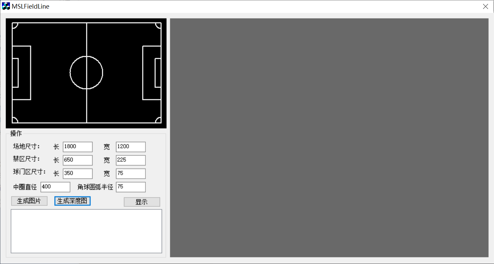

As shown, this is what the software looks like after opening. Enter the dimensions according to the actual match field size. The penalty-area size refers to the large penalty area, and the goal-area size refers to the small penalty area. There is no field for goal size here, because **the goal has a fixed size!** This is true regardless of the field-size ratio.

Click `Generate Image` to create a `field.bmp` file in the software's statistics directory. The image is also displayed in the upper-left corner of the software so the operator can check for simple data-entry mistakes, such as accidentally entering an extra 0. These mistakes are very obvious in the image.

Click `Generate Depth Map` to create a `fieldmap` in the same directory as the software. This image can be displayed on the right side of the software by clicking `Show`, as shown below. Generation takes a relatively long time, so wait patiently.

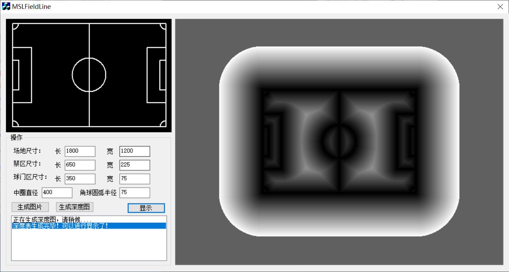

#### Config/TxtWR.exe (linear data interpolation tool)

##### 2023-08-27 by Hcm

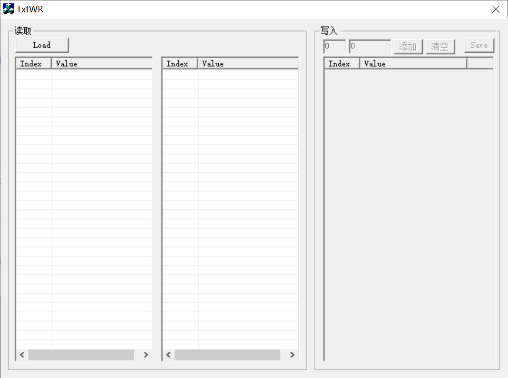

After the tool opens, the interface is shown in the image. This tool can only read documents and cannot write to them. Open any file. As shown below, it linearly generates data based on the vertical column on the left, and shows the result in the table in the middle.

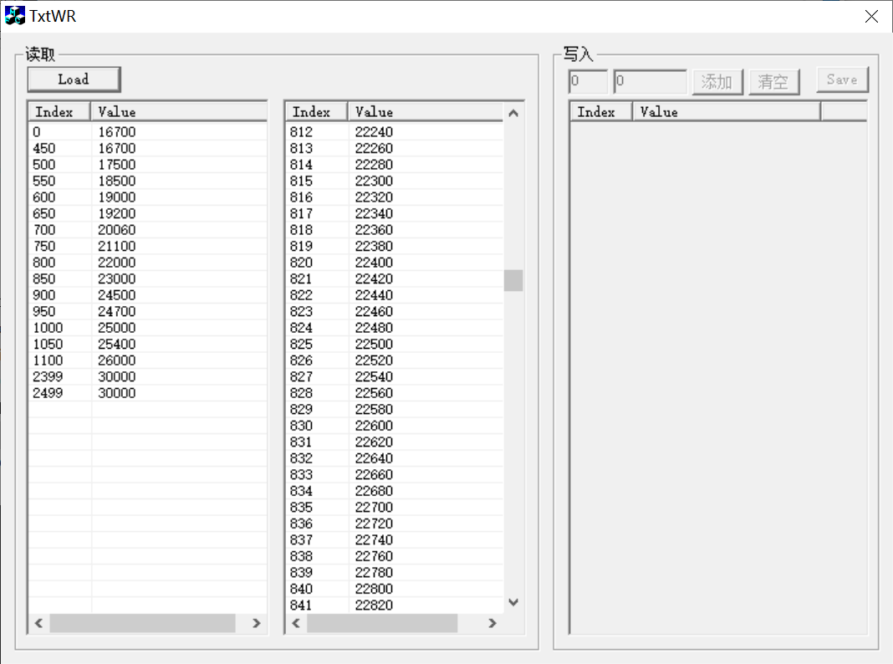

### Detailed MFC Framework Analysis

#### 2023-09-04 by xbx & Hcm

The coach station, player, and goalkeeper programs are all written using the MFC framework. MFC is a Windows framework that provides window-interaction functionality. It is similar to today's Qt, but much older, around 20 years old.

- StdAfx.h

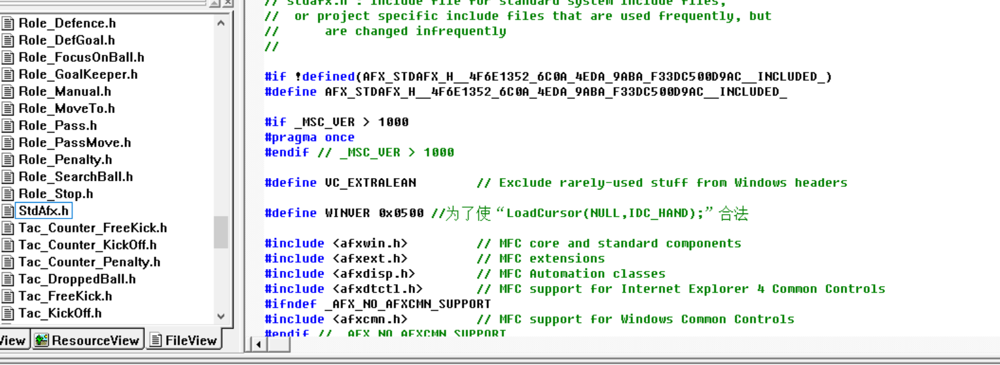

This is the MFC precompiled header file. It can speed up compilation. It must not be included by any `.h` header file, but every `.cpp` file must include it. This file also contains added Chinese comments, so it is worth reading.

- MSLFieldMonitorView.h

This file is automatically generated according to the project name when an MFC interface is initialized. The same applies to `MSLFieldMonitorDoc.h`, `MSLFieldMonitor.h`, and their corresponding `.cpp` files. The entry file of the whole large program is `MSLFieldMonitor.h`.

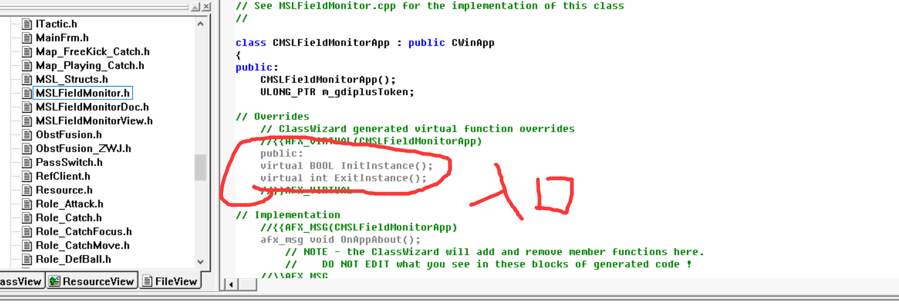

- MSLFieldMonitorView.cpp

This file is important. It contains callbacks for all buttons and several situation settings.

~~~cpp
//[3]传递指针
m_wndField.m_cGreenField.pDataSummary = (m_cDataCenter.m_dataSummary);
m_wndField.m_cGreenField.pCoachUDP = &m_cCoachUDP;
m_wndField.m_cGreenField.pDataCenter = &m_cDataCenter;
m_cDataCenter.SetCoachUDP(&m_cCoachUDP);
m_cDataCenter.pInfoList = &(m_wndReferee.m_cDataInfoList);
m_wndMatchPanel.pDataCenter = &m_cDataCenter;
m_wndMatchPanel.pRefClient = &m_cRefClient;
m_wndMatchPanel.pFiled = &(m_wndField.m_cGreenField);
m_cRefClient.pDataCenter = &m_cDataCenter;
m_wndStatus.m_disRobotStatus.pField = &(m_wndField.m_cGreenField);
m_wndStatus.m_disRobotStatus.pCoachUDP = &m_cCoachUDP;
m_wndStatus.m_disRoleStatus.pField = &(m_wndField.m_cGreenField);
m_wndStatus.m_disRoleStatus.pTac = m_cDataCenter.m_stTactics;
m_wndStatus.pTac_TC = &(m_cDataCenter.m_tac_TechChallenge);
m_wndMatchPanel.pKey = &(m_cDataCenter.m_dataSummary->key);
m_wndReferee.pKey = &(m_cDataCenter.m_dataSummary->key);
m_wndReferee.pRefClient = &m_cRefClient;
m_cRefClient.m_pShowList = &(m_wndReferee.m_cRefInfoList);
m_wndField.m_cGreenField.pObstFusion = &(m_cDataCenter.m_ObstF_Zwj);
m_wndStatus.pObstFusion = &(m_cDataCenter.m_ObstF_Zwj);
m_wndReferee.m_dlgAgentIPList.pCoachUDP = &(m_cCoachUDP);
m_cCoachUDP.pInfoList = &m_wndMatchPanel.m_cTacInfoList;
~~~

~~~cpp
void CMSLFieldMonitorView::checkKeyPressed()
{
	//shift 按下
	if (m_cDataCenter.m_dataSummary->key.bShiftPressed == true)
	{
		m_cDataCenter.m_dataSummary->key.bShiftPressed = false;
		m_wndMatchPanel.OnRefStop();
	}
	
	//ctrl 按下
	if (m_cDataCenter.m_dataSummary->key.bCtrlPressed == true)
	{
		m_cDataCenter.m_dataSummary->key.bCtrlPressed = false;
		m_wndField.m_cGreenField.m_bSetPlayerIn = true;
	}
	
	//A 按下
	if (m_cDataCenter.m_dataSummary->key.bKeyAPressed == true)
	{
		m_cDataCenter.m_dataSummary->key.bKeyAPressed = false;
		//AfxMessageBox(L"A Pressed");
		//[1]获取所选队员的ID号
		int nSelID = m_wndField.m_cGreenField.m_nSelAgentID;
		
		if (nSelID > 0 || nSelID <= AG_NUM)
		{
			//选择队员ID存在，继续进行后面操作
			//[2]切换到手动控制模式
			m_cDataCenter.ChangeMatchModeTo(MATCH_OFF);
			
			//[3]将所选的队员切换到进攻
			m_cCoachUDP.m_ToAgent[nSelID - 1].CtrlCmd(CTRL_ATTACK, m_cDataCenter.m_dataSummary->cGlobalBall.x, m_cDataCenter.m_dataSummary->cGlobalBall.y ,0,0,true);
		}
	}
	
	//S 按下
	if (m_cDataCenter.m_dataSummary->key.bKeySPressed == true)
	{
		m_cDataCenter.m_dataSummary->key.bKeySPressed = false;
		m_wndMatchPanel.OnRefStop();
	}
}
~~~

This file also has many comments and is worth checking.
